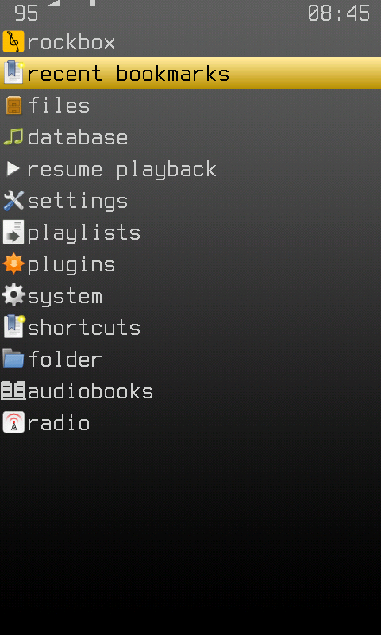
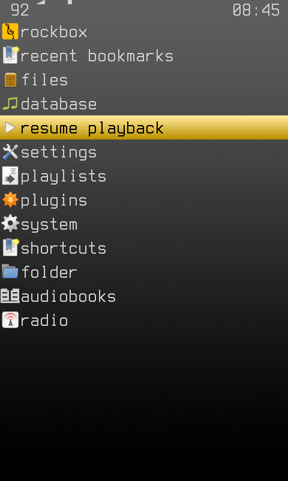
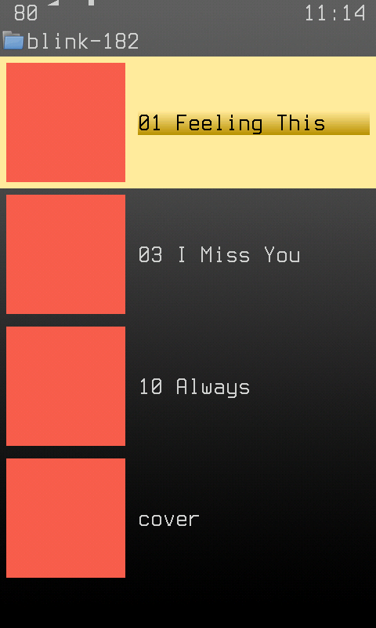
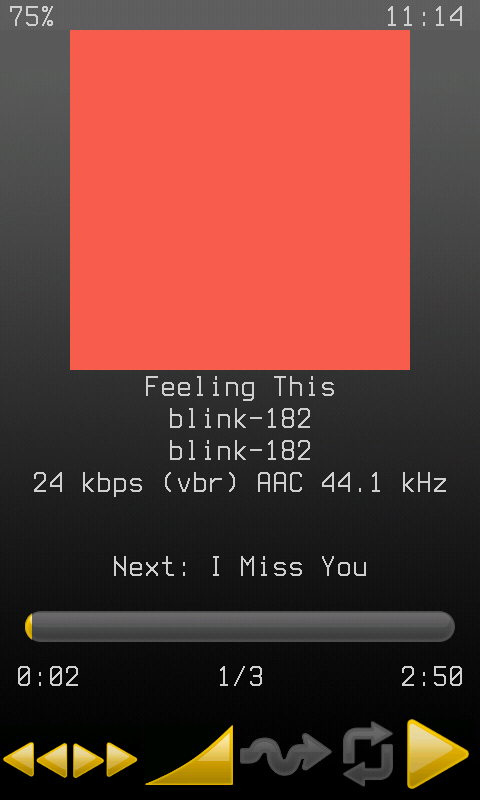

Nothing in this repo needs a particular computer. Everything that used to
live on one WSL box - the cross toolchain, the simulator, the screenshots -
runs on a GitHub-hosted runner, and the repo is public, so the runner minutes
are free.

## What runs where

| Need | Where | How |
| --- | --- | --- |
| Write code | any Claude Code session (desktop, web, or `@claude` on an issue) | needs `git` and `gh`, nothing else |
| Stick engine tests | `stick-tests` job | `make -C tools/stick_test test`, seconds |
| Device build | `build` job | cached toolchain, `rockbox.zip` as an artifact |
| Look at the UI | `simulator` job | native build, driven by `tools/simctl`, screenshots as an artifact |
| Review | `claude-code-review.yml` | runs on every PR |
| Triage, upstream watch | `claude-triage.yml`, `upstream-tracking.yml` | on issue open / weekly |

All of it is in `.github/workflows/`. The simulator job is about three minutes
from a cold runner: the simulator is a native build, so it does not
wait for the cross toolchain.

## Getting a screenshot with no machine

Push the branch. The `simulator` job runs `tools/simctl/tests/smoke.txt` and
uploads the frames:

```sh
gh run download <run-id> -n simulator-shots
```

What comes back, from a runner, before and after the drag in the smoke
script:




To drive something else, commit a script in the
[simctl language](https://github.com/WillNHT/rockbox-hiby-r1/blob/master/tools/simctl/README.md)
and point the job at it:

```sh
gh workflow run build.yml --ref <branch> -f sim_script=tools/simctl/tests/mine.txt
```

The simdisk on a runner is a fresh `make install` plus the library
`tools/simctl/fixtures.sh` makes from `tools/simctl/fixtures/library.tsv`:
29 tracks under `Music/<artist>/<album>/`, with real tags and lengths and a
sine tone for audio, so no recording is stored in the repo. The database is
not built; a script that needs it has to initialise it first.

The job also runs `tools/simctl/tests/library.txt`, which browses that
library and plays a track; its frames are under `library/` in the artifact:




A fresh config has the stick on, so a script moves the way a thumb does: a
short slow drag up is one row down, a slow drag right opens, left goes back.
A plain tap on a row does nothing. `library.txt` is the pattern to copy.

## What it costs

* **Runner time** - free for a public repo on the standard runners.
* **Tokens** - the workflows authenticate with `CLAUDE_CODE_OAUTH_TOKEN`, a
  Claude subscription, so an agent run draws on the same allowance as an
  interactive session and nothing is billed per token. What a run actually
  uses is not measured yet; that is issue #48.
* **Building and testing cost no tokens at all.** They are plain jobs. An
  agent only pays to read the result, so the rule in `CLAUDE.md` holds: push
  and read the run, do not build locally.

## One agent or several

One agent per task, and the pipeline as the other roles. The jobs above are
already the tester and the builder, the review workflow is the reviewer, and
the human is the approver. A separate orchestrator or tester agent would
start cold, re-read what the coder already knows and pay for it in tokens,
to do what a free job does deterministically. Add one when a role turns up
that a job cannot fill.

## What still needs hardware

Anything labelled `needs: device test`: the real touch panel, audio out,
battery, Bluetooth, the bootloader. The simulator shares the UI code, not the
drivers.
