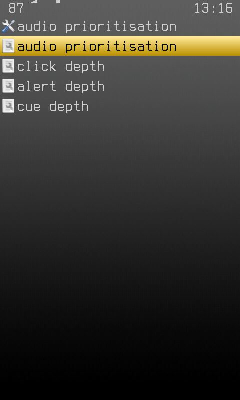
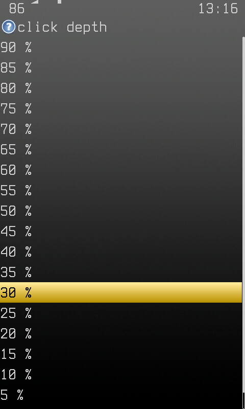

A keyclick or a lock chirp is a few milliseconds of square wave mixed in on
top of whatever is playing. With music under it at anything like a normal
listening level the two fight for the same headroom and the device sound
loses - which is a problem, because the device sound is the one carrying
information the user asked for.

Audio prioritisation steps the music aside for the length of the sound. The
playback mixer channel drops by a set amount, the sound plays over the gap,
and the channel comes back a fraction of a second later.

## The settings

**Settings - General Settings - System - Audio Prioritisation**

| Setting | Default | What it does |
| --- | --- | --- |
| Audio Prioritisation | On | Master switch. Off means the music is never touched. |
| Click Depth | 25% | Keyclicks and the list edge beeps. |
| Alert Depth | 45% | Track skip, and the end of a playlist. |
| Cue Depth | 70% | Lock, unlock and the stick arming run. |

Three depths rather than one because the sounds are not equally important.
A keyclick happens on every press, so a deep duck would pump the music all
the way through a menu; a lock cue happens once and has to be heard with
the player already in a pocket.

Depth is how far the music drops, so 0% is no ducking at all and 90% is
nearly silent. The music returns 150 ms after the sound ends, which is long
enough that a run of chirps - the arming run, or the two-note lock cue -
holds one duck rather than flapping the volume between notes.

## Track Change Static

**Settings - Playback**

A burst of white noise on a user-initiated prev/next, the same static the
[pseudo-radio](pseudo-radio.md) plays while tuning in - the old habit of a
station change never arriving clean. It ducks at Alert Depth, the same as
the track-skip beep it replaces the silence around.

The skip happens at once and the static plays across it, covering the
moment the next track takes to load. It used to play first and skip after,
which held the old track and the screen for the whole burst and then left
the silence it was meant to cover.

With **Crossfade** set to *Always*, a skip also fades the next track in
over the crossfade's fade-in time - that is the start of a track sounding
cut after a skip. *Automatic Track Change Only* keeps crossfading between
songs and lets a skip start at full volume.

| Setting | Default | What it does |
| --- | --- | --- |
| Track Change Static | On | Master switch. |
| Track Change Static Duration | 1000 ms | How long it plays (100-3000 ms). |

## In config.cfg

```
audio prioritization: on
audio prioritization click: 25
audio prioritization alert: 45
audio prioritization cue: 70
track change static: on
track change static duration: 1000
```

## Screenshots

| The menu | A depth |
| --- | --- |
|  |  |

## Startup volume

**Settings - Playback**

Resuming just after power-up - the WPS as the start screen - brings back
whatever was playing last at whatever volume it was left at, which is how
the loudest song of yesterday arrives in the ears at once. It now comes back
gently: no louder than **Startup Volume Limit**, and faded in from silence
over three seconds.

| Setting | Default | What it does |
| --- | --- | --- |
| Fade In At Startup | On | The music comes up from silence over 3 s. |
| Startup Volume Limit | 40 % | The most volume a power-up resume comes back at. Lower volumes are left alone; 100 % turns the limit off. |

The fade is the same lever as the ducking above, held down longer, so a
device sound during it - the radio tuning in - does not cut it short.

```
startup fade in: on
startup volume limit: 40
```
