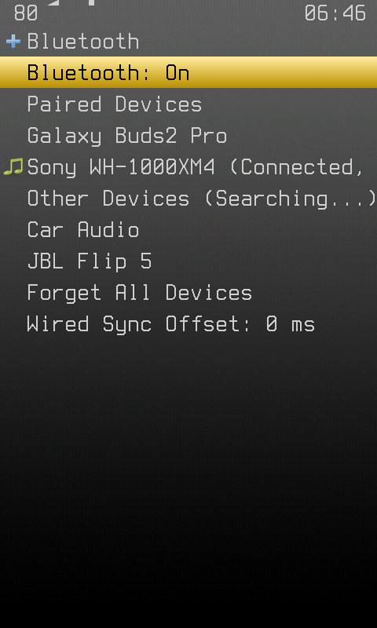
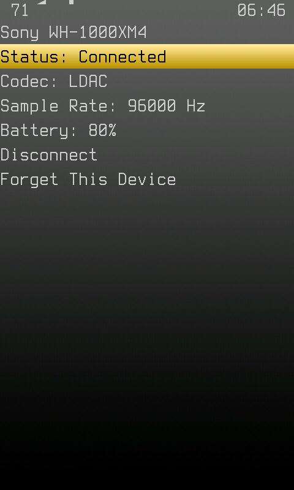
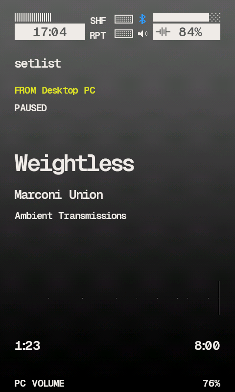
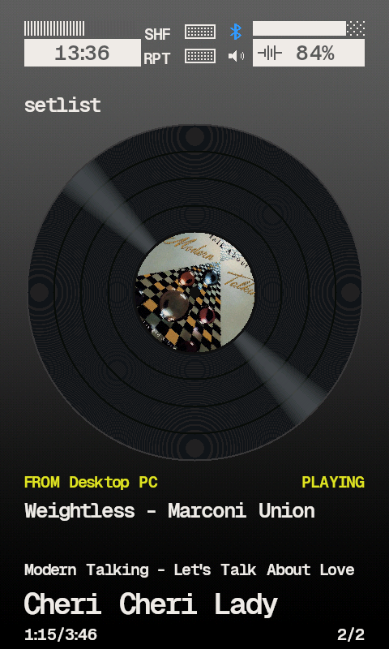
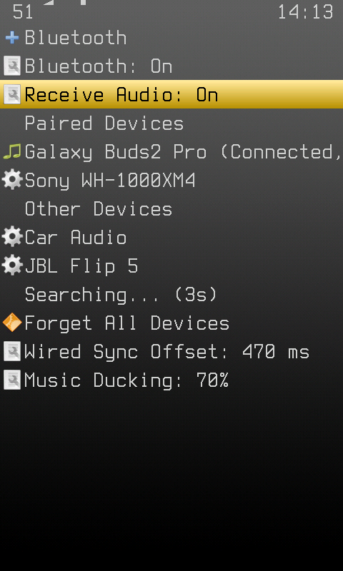

# Bluetooth Support for Hosted Hiby Rockbox Build

This build integrates [bidhata's patches](https://github.com/bidhata/hiby-r1-rockbox-bt) and drives the standard BlueZ (`bluetoothctl`) and bluealsa (`bluealsa-cli`) tools instead of HiBy's proprietary `sys_server`.

## Using it

Everything is on one screen, **Main Menu → Bluetooth**, laid out like a phone's:

*   **Bluetooth: On / Off** - select to switch. Turning it on reconnects the last headset that played.
*   **Paired Devices** - select one to connect. A connected one shows `(Connected, 80%)` when the headset reports its battery; select it, or long-press any paired device, for its page.
*   **Other Devices** - found while the screen is open (`Searching...`). Select one to pair and connect. A device that shows a code asks you to confirm it; one that wants a PIN gets `0000`.
*   **Forget All Devices**, **Wired Sync Offset** - at the bottom.

A device's page shows its status, codec, sample rate and battery, and has **Connect/Disconnect** and **Forget This Device**. Select the codec to change it; playback pauses for the switch and carries on afterwards.

The quickscreen's **Sound** page has a Bluetooth on/off toggle in its bottom slot.

Headset buttons work as media keys, and the headset's own volume buttons move the player's volume. Earbuds put back in the case and taken out again reconnect on their own.

## How it behaves

*   Nothing Bluetooth does blocks the UI: the commands run on a thread of their own and the screen updates as they finish.
*   When the headset goes away (switched off, out of range), playback pauses and the jack takes over, as on a phone. A headset that disappears in the middle of a route falls back to the jack instead of crashing.
*   Bluetooth comes back on after a reboot if it was on. The stock bootloader suspends the stack at boot; turning Bluetooth on resumes it, so the custom bootloader is no longer required, only faster.

## Receiving audio

**Receive Audio: On** makes the player a Bluetooth speaker as well: a PC or phone can play to it, and its sound is mixed in with the music. While the sender plays, the music drops by **Music Ducking** (70% unless set otherwise, at the bottom of the screen); it comes back over half a second once the sender has been quiet for a second. The sender's own volume slider sets how loud it plays; its audio is played at twice the level it arrives at (+6 dB, clipped), because a PC at 100% was barely heard.

*   To pair a PC, open the Bluetooth screen with Receive Audio on and pair from the PC. The player is visible and accepts the pairing while the screen is open, with no code to confirm.
*   After that, the PC connects on its own, and is heard within a few seconds. It shows as `(Receiving)` on the screen.
*   Tapping a paired PC or phone on the screen connects it as a sender, turning Receive Audio on if it was off, and leaves a connected headset where it is.
*   The sender's audio comes out wherever the music does: the jack, or the headset.
*   Transmitting to a headset keeps working with Receive Audio on: bluealsa runs both profiles in one daemon. They share one radio, so receiving beside an LDAC headset may stutter; a lower codec on the headset helps.

Switching it restarts bluealsa, which takes a few seconds: the row reads `Turning On...` / `Turning Off...` until it is done, and a connected headset drops for a moment and reconnects.

### What the sender plays, and its keys

The sender's track, as its media player reports it over AVRCP (BlueZ's `MediaPlayer1`, read with `dbus-send` every two seconds): title, artist, album, position, playing or paused, and its volume. An iPhone reports all of it; a Windows PC reports what apps that use its media controls play (Spotify, a browser, the stock player), and only its name otherwise.

The Now Playing screen has three layouts, picked by **Bluetooth View** (quickscreen → Playback → **Bluetooth**, up and down to cycle):

*   **Auto** (default): the player's own screen while only the player plays, the **Receiver** screen while only the sender does, **Both** while both do. With nothing playing the last one stays, so pausing does not swap the screen.
*   **Player**: the player's screen as before.
*   **Receiver**: the sender's screen, where the cover and the track were: who is sending, its track, its time and `PC VOLUME`.
*   **Both**: the player's screen, with the sender's name and track in the band under the cover.

While the sender plays and the player does not, the keys work the sender, whatever the screen: POWER tap and a headset's play key are its play/pause, and the track keys and a headset's next/prev are its next and previous track. With nothing playing they stay with whichever played last. While the player plays they are the player's. The volume keys are always the player's volume, which the sender's audio goes through too.

Skin tags: `%?Bm<player|receiver|both>`, `%?Bs<stopped|playing|paused>`, `%Bt` title, `%Ba` artist, `%Bl` album, `%Bn` the sender's name, `%Bv` its volume (%), `%Be` / `%Bd` elapsed and duration. Snappy V2 and Snappy Vinyl have the Receiver and Both layouts; the other skins show the player's screen in all three.

### Latency: PC to player to headset

What the PC plays reaches a headset through two radio links and every buffer between them. The two links and the headset's own buffer are fixed; the player's part is kept short:

*   The receive ring is held under about 70 ms. The sender's clock is not the player's, and before, what it got ahead by piled up until the ring was full (about 190 ms, plus up to 200 ms waiting in the capture). Above the line one frame in 512 is dropped, which is not heard.
*   The capture holds at most 50 ms, down from 200.
*   While a sender is connected the headset's buffer is halved, about 93 ms instead of 186 at 44.1 kHz: the headset's audio is reopened when the sender comes and goes, a quarter-second gap. LDAC may stutter at the smaller buffer; SBC or AAC on the headset keeps it smooth and adds less delay of its own.

The debug log's `bt rx:` line says how much the capture and the ring hold.

### Levels

*   **Levels:** quickscreen → Playback → **Bluetooth** → **Bluetooth Mix**. Up/down sets **PC Volume**, the sender's audio; right/left sets **Player Level**, the player's own audio, which the PC's never goes through.
*   **Icon:** the Snappy skins show an arrow into a tray beside the rune: grey while Receive Audio waits for a sender, blue while one plays (`%?Br<off|waiting|receiving>`). In the WPS it sits under the rune, where the jack's speaker goes in dual output.

## Debug log

Nothing is logged by default. Create an empty `rockbox-bt-debug.log` at the root of the SD card to switch logging on; it is cut back once it passes 512 KB.
