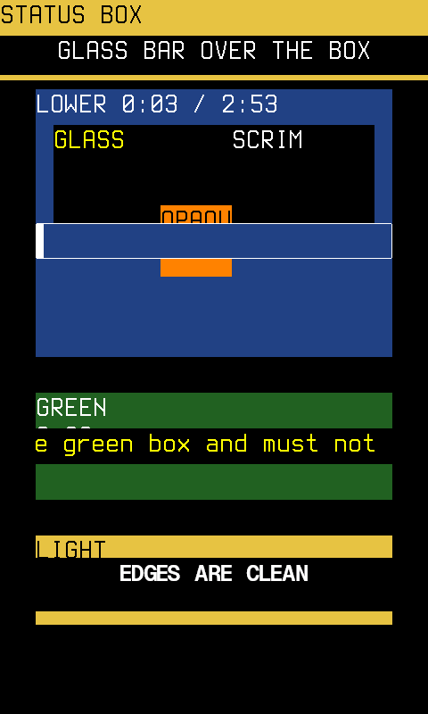
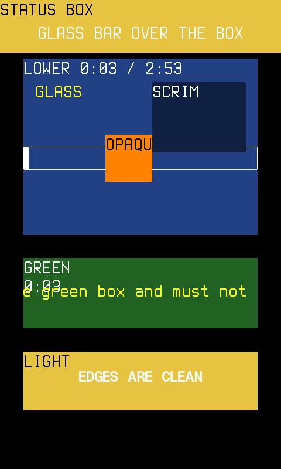
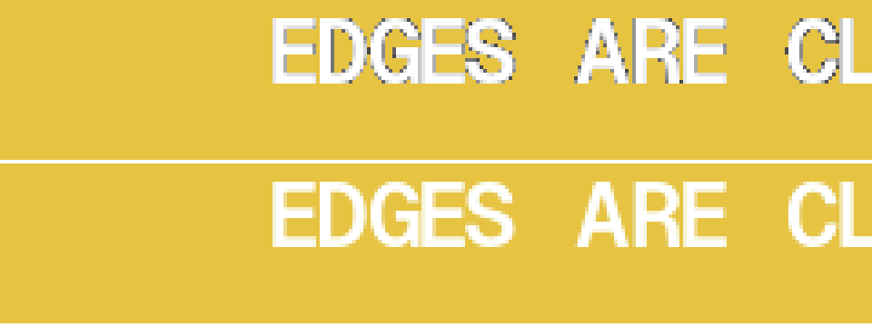

# Layering

How a skin's viewports stack on the status bar, the WPS and the FM screen,
and what `%Vt` means now.

## The rule

Viewports stack in the order the skin declares them: a later one is on
top of an earlier one wherever they overlap. Upstream Rockbox only kept to
that order on a full redraw. This fork keeps to it for every redraw.

- **`%Vt(n)`**: the viewport's background is its background colour at
  `n` percent opacity, over whatever is beneath it. That includes the other
  viewports, not only the backdrop. `%Vt(0)` is glass and `%Vt(100)` is
  solid. A value in between is a scrim, and it stays live: when the
  viewport beneath redraws, the scrim shows the new picture.
- **No `%Vt`**: opaque, as before. The viewport shows the backdrop if
  there is one, and its background colour if there is not.
- **`%dr(...,alpha)`** in a viewport that is on top of another one
  blends over what is beneath it too.
- **Text** in a viewport on top of another one is antialiased against what
  is beneath it, as it would be anywhere else.
- **The status bar skin** sits above the screen it is on.

The test skins in `tools/simctl/tests/layering/`, before and after. In
the status bar, a glass bar sits over a yellow box. In the WPS, the blue
box is beneath everything and redraws every second; on top of it are a
glass viewport, a 50% scrim, and an opaque orange box over its progress
bar. Lower down are a scrolling glass line over a green box, and white
antialiased text on glass over a light box:

## Why it used to break

Rockbox draws straight into the framebuffer. Before this change, the
framebuffer and the backdrop were the only two surfaces:

- A viewport's clear copied the backdrop. If a glass viewport sat on top
  of another viewport, its clear wiped the one beneath it.
- Anything that redraws on its own wrote straight into the framebuffer:
  a line with a dynamic tag (the time, the peak meter), a progress bar,
  a scrolling title. Whatever sat on top of it got painted over. This is
  why the Gauge modal had to hide every viewport beneath it.

## How it works

A viewport that overlaps one declared before it is *lifted*. It draws
into a surface of its own (`firmware/drivers/lcd-layers.c`) and never into
the framebuffer. Its clear makes the surface transparent, and its
background is stored as a veil. When the panel is updated, the surfaces
are composed over the framebuffer in declaration order: the veils first,
then the surface's own pixels. The stick overlay has been drawn this way
since #2, and it stays on top of them.

So nothing beneath a lifted viewport can paint over it, and its own
clears never touch what is beneath it.

A glyph edge that lands on a transparent pixel keeps the ink and records
how much of the pixel it covers (`lcd-16bit-common.c`). It is blended
with whatever is beneath when the panel is updated. Blending it at draw
time against the transparent key, which is nearly black, gave text a
dark outline. Blended against the key, then as it is now, four times
enlarged:

A viewport that builds the `%Cb` backdrop does not count as beneath
anything: what it draws reaches the panel only through the backdrop.
Without this rule, every viewport in Snappy Animated would sit over its
full-screen backdrop viewport and be lifted.

## Cost

Measured in the simulator, with Snappy Animated playing:

| Screen | Surfaces | Pixels | Share of the panel |
| --- | --- | --- | --- |
| WPS | 5 to 6 | about 67,000 | 17% |
| Status bar, in the menus | up to 6 | about 92,000 | 24% |

Each panel update copies the area under the surfaces out and back, and
blends the surfaces in between. That is about three passes over 17% of
the panel per update on the WPS. A skin with no overlapping viewports
lifts nothing and pays nothing.

Memory: one panel-sized arena (768 KB) and its coverage plane (384 KB) are
shared by every surface. On the R1 these are untouched memory until a
surface uses a row, so only the rows in use are resident. When there is no
room, a viewport draws the old way until the next full redraw.

## Limits

- **Splashes and full-screen takeovers** (USB, plugins) bake the surfaces
  into the framebuffer first, so that they draw on top of them. Until the
  next full redraw the skin then draws the old way.
- An image drawn over the antialiased edge of text in the same lifted
  viewport keeps that edge's coverage, and lets a little of what is
  beneath show through.
