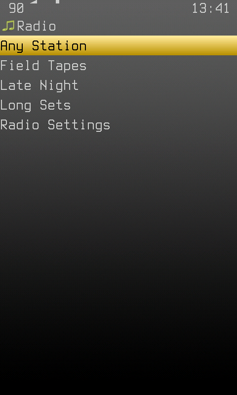
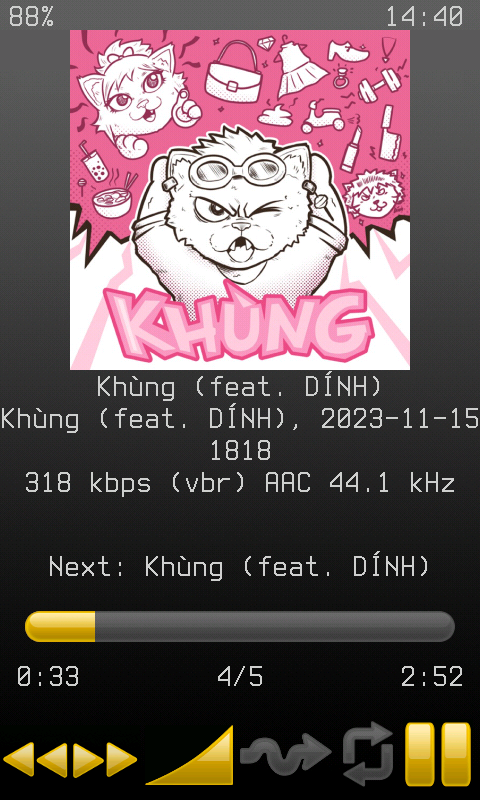
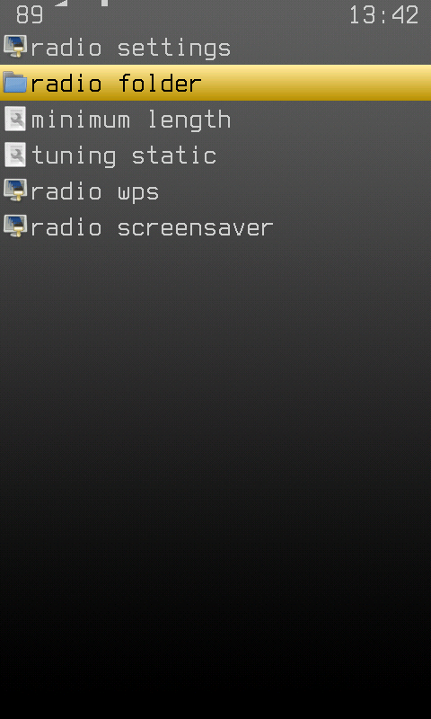
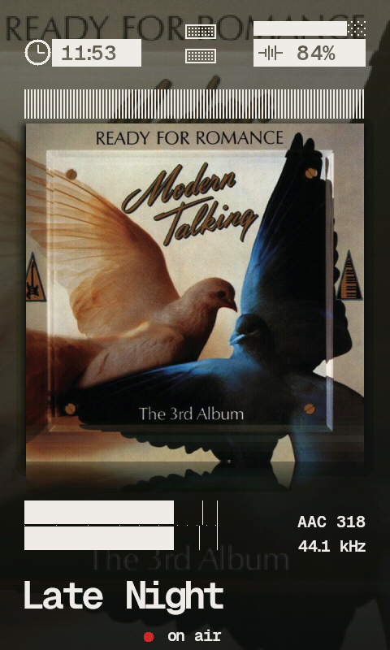
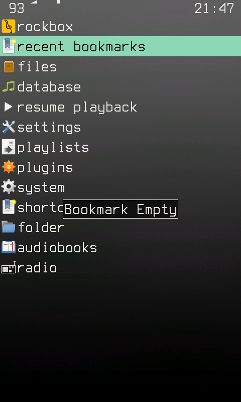

The R1 has no tuner, so this is not one. It is a folder of long recordings
and a way of dropping into one part-way through, which turns out to be most
of what makes a radio feel like a radio: what you hear is already underway,
and you did not pick it.

Tuning in drops into a recording part-way through, wherever the station has
got to by the clock. There is no station database and no scan - the folder
tree is the dial.

## Tuning in

The **radio** entry in the main menu does not open a list. It puts you back
on the station you were on last, or picks one when there is no last - a
radio hands you sound, not a menu. Walking into it while that station is
already playing does nothing at all, which is what stops the entry from
throwing away the thing you came back to look at.

Picking a station by name is **Settings > Playback > Radio > Stations**,
which is where the rest of the deliberate choices already are.

## Stations

Stations are the immediate subfolders of the radio folder, and the tracks
sit directly inside a station:

```
/radio
  /Late Night
     set-01.mp3
     set-02.mp3
  /Field Tapes
     harbour.flac
  /Long Sets
     ...
```

A radio folder with no subfolders is one station, so the simplest setup is a
folder with files in it and nothing else to configure. **Any Station** at the
top of the station list picks a station for you first, then tunes it.

A station is everything under its folder, any number of levels deep, so a
station can be organised into its own subfolders without breaking scanning.

## Dynamic stations

A station can also be made from your music library instead of a folder of
recordings. Put a `station.cfg` in the station's folder and the station
plays whatever in the database matches it:

```
/radio/Groovy Baby/station.cfg
```

```
# The late seventies
year: 1976-1980
```

| Line | Matches |
| --- | --- |
| `year: 1976-1980` | tracks from those years; a single year works too, and several ranges can be given separated by commas |
| `artist: Blink-182, Green Day, Nirvana` | tracks by any of those artists (artist or album artist, any case) |
| `genre: Punk, Grunge` | tracks of any of those genres |

Every line narrows the station further; the values on one line are
alternatives. The file is what makes a station dynamic, so a station is
never both: with a `station.cfg`, anything else in the folder is ignored.

The station's music is written to `setlist.m3u8` next to the
`station.cfg`. Setlists are built in the background, when you enter the
radio, for any dynamic station that has none; tuning into one before its
setlist exists builds it there and then, the one time you wait for it. A
setlist stays as it is until you ask for it again, so a station is the same
station between database updates:

* **Radio Settings > Rebuild Setlists** rebuilds every dynamic station in
  the background.
* A long press on a dynamic station in **Stations** rebuilds that one.

Everything else is the same as a folder station: it has a clock, prev/next
moves the dial, the clock moves it on to the next song every few minutes
rather than every two hours, and nothing is bookmarked. Its cover is the
station's `cover.jpg` when it has one, and each song's own artwork when it
does not.

The radio WPS says which kind is on: `on air - static` or
`on air - dynamic`. `%rd` is that word, for any skin, and is empty off the
radio.

Stations that make themselves - from what you actually listen to, say -
would only need to write `station.cfg` files; the rest is already here.

## While tuned in

Prev/next moves the dial instead of stepping through the station's files -
a radio does not let you skip to the next track of the thing playing, it
switches you to something else. Next is the station after this one in the
station list and previous the one before, wrapping round at either end, so
every station is a few presses away. A station with more than one file also
plays them in an order of its own rather than alphabetically.

Pausing does not stop the station. Come back after more than half a minute
and the station is tuned in again by its clock, as far along as the time you
were away - so a pause over lunch returns to a different part of the
programme, not to the syllable you left on. Shorter pauses resume where they
were, because a phone call is not an afternoon.

Switching the player off does not stop it either. With a station last on,
resuming at power-up (the WPS as the start screen, or Resume Playback) tunes
the station in by the clock rather than resuming the second it was left on.

Nothing the radio plays is bookmarked. A station was tuned into part-way
through on purpose, so the second you left it at is an accident of when you
left; writing it down would put an arbitrary offset into the recent
bookmarks and into the resume information, where the next album or book to
play would pick it up and start in the middle of a track nobody asked it
to.

### Station cover

A station's artwork is `cover.jpg` (or `.png`/`.bmp`) in the station folder:

```
/radio/Late Night/cover.jpg
```

It is used for every file in the station, however many subfolders deep the
file itself sits, and it wins over the ordinary album-art search. Without one
the normal album-art rules apply.

A branch of a station can have a cover of its own. The closest `cover.jpg`
wins: the one in the file's own folder, else the one in the folder above,
and so on up to the station folder - never one in a folder below the file.

```
/radio/Late Night/cover.jpg              <- set-01.mp3, and anything without its own
/radio/Late Night/set-01.mp3
/radio/Late Night/Guests/cover.jpg       <- Guests/a.mp3 and Guests/2019/b.mp3
/radio/Late Night/Guests/a.mp3
/radio/Late Night/Guests/2019/b.mp3
```

## Settings

**Main Menu - Radio - Radio Settings**

| Setting | Default | What it does |
| --- | --- | --- |
| Radio Folder | `/radio` | Where the stations are. |
| Minimum Length | 10 min | How long a recording must be to be preferred. |
| Tuning Static | On | The hiss played while tuning in. |
| Rebuild Setlists | - | Rebuilds every [dynamic station](#dynamic-stations)'s setlist in the background. |
| Radio WPS | Same as Music | The WPS used while a station plays. |
| Radio Screensaver | Same as usual | The screensaver used while a station plays. |

Point the radio folder somewhere else the same way as the audiobooks folder:
the folder's context menu in Files, under **Set As**, or from the main menu
layout editor.

### Minimum Length

A three minute pop song entered at 60% is a song with its first minute cut
off. An hour-long set entered at 60% is a radio. The floor is what keeps the
difference. Ten minutes by default, which is low enough to let a long album
track or a podcast episode count and high enough to keep singles out.

It is a preference rather than a filter: tuning reads the tags of a handful
of randomly chosen files and takes the first one over the floor, so a station
holding nothing long enough still plays something instead of refusing. Set it
to Off to take whatever comes.

Reading tags for a handful of candidates is also why a large radio folder
costs nothing to tune - there is no up-front scan of the folder.

### Where it drops in

A station is a transmitter, not a file: it is playing whether or not anybody
is listening, and where it has got to is a function of the clock and of
nothing else. Leave one - for a pause, for another station, for a week with
the device switched off - and coming back finds it exactly as far on as the
time that went by. Nothing is written down, so there is nothing to fall out
of step.

Anywhere in the recording except its last minute: a radio has no reason to
prefer the beginning, and the beginning is the one part you could have had
by pressing play. The station's own name is the phase, so no two stations
are ever playing the same second of the same thing, and the order a
station's files go out in is that same number rather than the tick - a
schedule, stable but not alphabetical, which is what a station has and a
folder does not. A station stays on one recording for two hours before its
schedule moves to the next.

### Tuning Static

Every transition the dial makes has its own noise, because a radio you
cannot hear yourself operating is a file player with different words on it.
There are five:

| When | What it sounds like |
| --- | --- |
| Tuning in | hiss swelling up, with a carrier sliding into place |
| Prev/next | shorter and harsher, a whistle sweeping past everything between |
| Pause | the carrier falling away underneath |
| Resume | the same, rising |
| Leaving | a low thump, the sound a set makes going off |

They go through the same mixer channel as the keyclick and duck the music
the same way, at the Cue depth in
[Audio Prioritisation](audio-prioritisation.md).

All of them are generated, so nothing has to be on the card for them.
**Static Strength** scales all of them together, from a tenth to twice;
**Tuning Static** turns the lot off.

#### Your own sounds

Any of them can be a sound file instead. Put a WAV of the right name in
`/.rockbox/radio/` and it plays in place of the generated noise:

| File | Replaces |
| --- | --- |
| `tune.wav` | Tuning in |
| `retune.wav` | Prev/next |
| `pause.wav` | Pause |
| `resume.wav` | Resume |
| `leave.wav` | Leaving |
| `band1.wav` ... `band5.wav` | The five [band noises](#band-noise), in the order listed there |

Plain 16-bit PCM WAV, mono or stereo, at any sample rate; up to about three
seconds, and a longer file is cut. **Static Strength** still scales them and
they duck the music the same way. A theme can ship a set by including the
folder. Delete a file to get the generated sound back.

### Band Noise

Every hour or two, something drifts past on its own: a station passing
behind this one, a moment of interference, a signal fading out and back, a
squeal from somewhere adjacent, distant weather on the band. One of five, at
a random gap of 75 minutes give or take 45, and ducked shallower than a cue
because it is meant to sound like it is coming *through* the programme
rather than instead of it. **Band Noise** turns it off.

### The station cover

A station's artwork is `cover.jpg` (or `.png`/`.bmp`) in the station folder.
See [Station cover](#station-cover) above.

## A radio WPS

**Radio WPS** in the settings picks a skin used only while a station is
playing. `SnappyRadio` ships with the theme family: Snappy Animated with
the parts that do not apply to a radio taken out - no elapsed, no total, no
"3 of 52", and no file name, because the file is how the station is made
rather than a second thing you tuned to. The station has the block to
itself, and the footer says `on air` or `paused` with a red dot beside it
that blinks while the carrier is up. No codec or bit rate either - how a
file was ripped is not something a radio has to say - so the level meter
has the whole width of the band.

A station running on from one recording into the next is not a track change
anybody asked for, so it is not animated: the screen stays put and the sound
carries on. The track change transition only plays when the picture changes
- another station, or a branch of this one with a
[cover of its own](#station-cover).

The station name comes from `%rs`, a skin tag this fork adds. It is the
station folder's name, and it is empty when what is playing is not a
station track, so `%?rs<...|...>` is how any skin can tell it is on the
radio at all.

## In config.cfg

```
radio folder path: /radio
radio last station:
radio minimum length: 10
radio static: on
radio static strength: 100
radio band noise: on
radio wps:
radio screensaver:
```

## Screenshots

| Stations | Tuned in, part-way through | Settings |
| --- | --- | --- |
|  |  |  |

| The radio WPS | The menu entry |
| --- | --- |
|  |  |

The station in that shot is `/radio/Late Night`, the file on air is three
folders below it, and the cover is the station's - `cover.jpg` next to the
station folder, not next to the file, and not the artwork the file happens
to embed.
