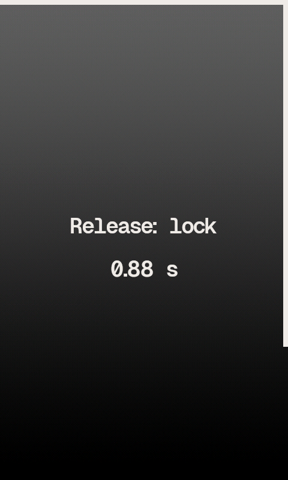
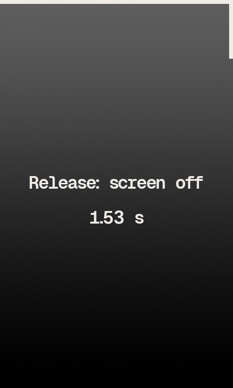

# Touch Controls

If you have trouble tapping the right element in lists, you can increase line height with the `Line Padding in Lists` setting (in `Settings > General Settings > Display > Touchscreen Settings`).
It's also useful to set the `Line Separator` to `Auto` (in `Settings > Theme Settings`) to see the element tap zones:

This build includes touch controls (gestures, swipes and kinetic scrolling) developed by [**amachronic**](https://gerrit.rockbox.org/r/c/rockbox/+/5393).

In Development build: I made some modifications to kinetic scrolling to remove "inertia" when stopping - it now stops immediately on a tap or at the end of the list. Feels snappier to me.
Removed the tap on the right half to bring up the **Quickscreen** (caused too many activations for me when I expected to go **Back** instead).

## 1. In Lists and Menus

**Header Taps**
- Tap on the left half of the titlebar to go **Back** or Cancel
- Tap on the right half to ~~bring up the **Quickscreen**~~ go **Back** or Cancel
- Long press on the left half to return to the **Root Menu**
- Long press on the right half to go to the **WPS**

For right-to-left languages, the left/right shortcuts are swapped.

**Edge Swipes** (Note: should really start from the edge of the screen, and longer swipes are more likely to be recognized)
- Top to bottom - **Quickscreen**
- Right to left - go to the **WPS**
- Left to right - **Back** 

## 2. While Playing Screen (WPS)

**Edge Swipes**
- Top to bottom - **Quickscreen**
- Right to left - **Current Playlist / Cuesheet**
- Left to right - **File Browser**
- Bottom to top - **Context Menu**

## Touch lock and screen off

Hold **Power** and let go:

- at **0.5 s** - lock or unlock the touchscreen. The keys keep working while it is locked; `LOCKED` shows under the header.
- at **2 s** - screen off. The keys still work in the dark and do not wake it, and the touchscreen is off; a **Power** press brings the screen back and does nothing else. While it is off the LED blinks while playing and stays lit while paused (not on the charger, where it shows charging).
- hold **4 s** - shut down, as before.

The countdown says what letting go now will do; the border round the screen starts again at each step.

